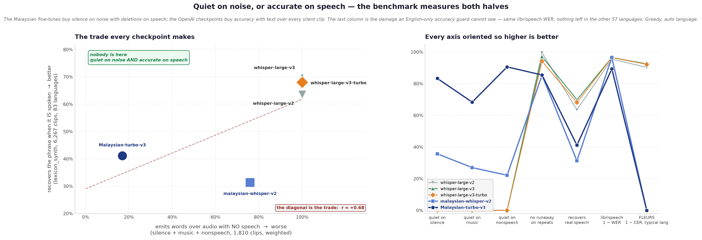
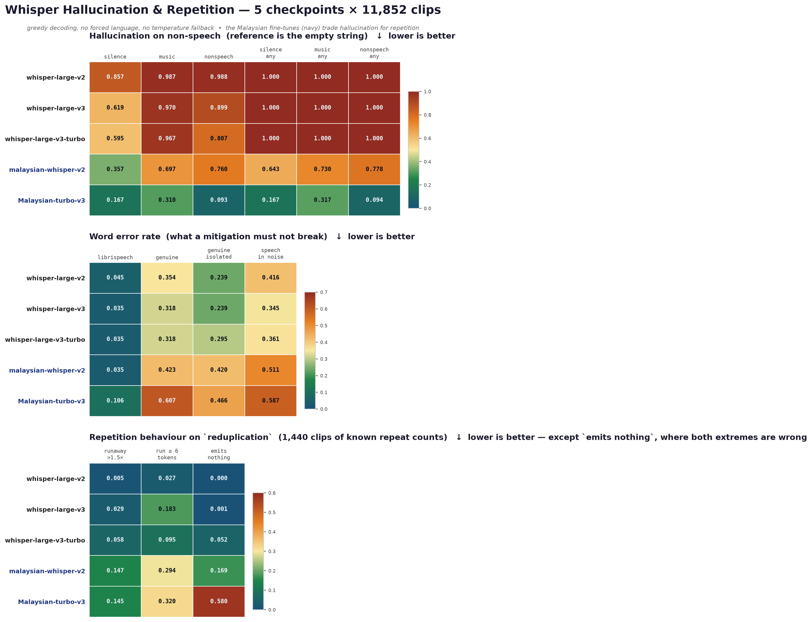
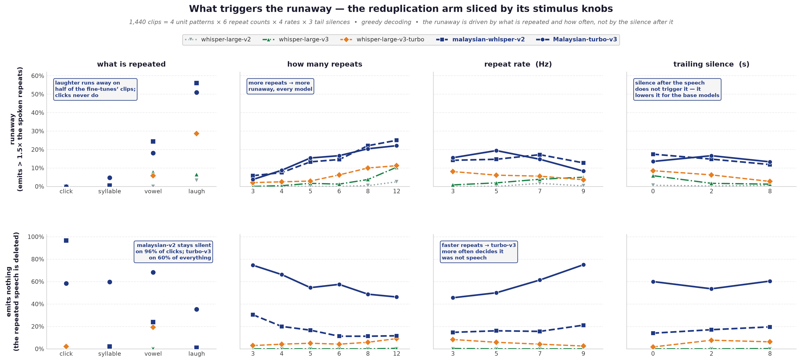
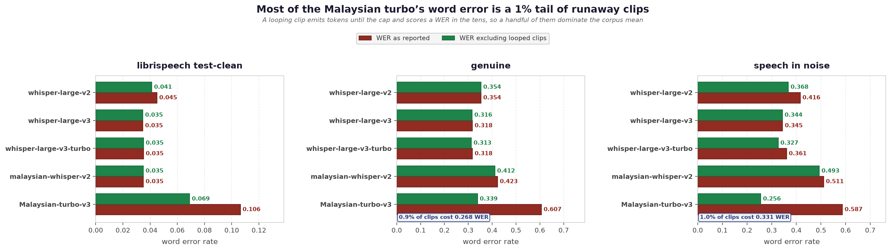
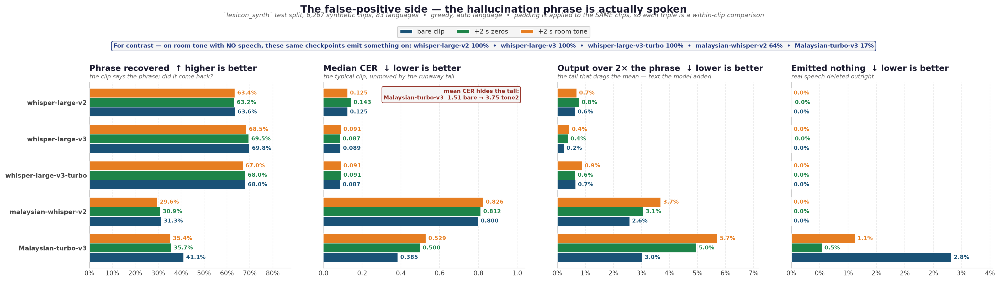
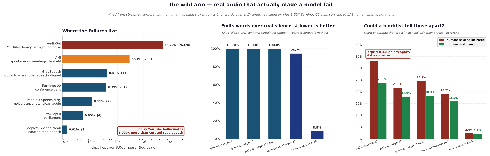
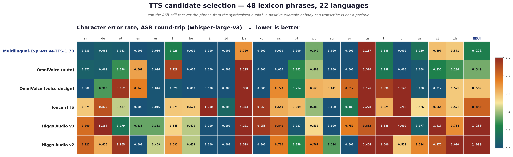
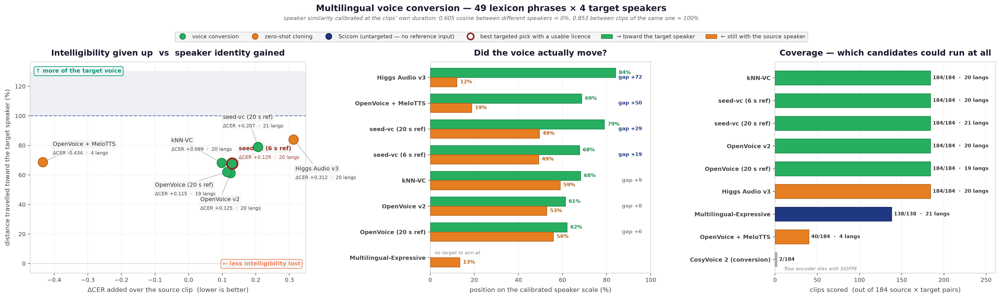
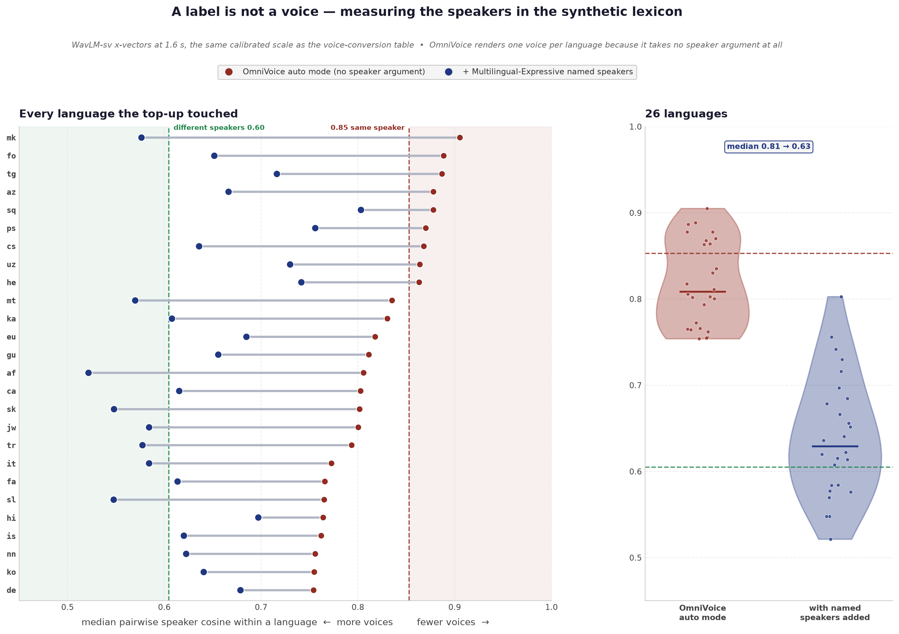

# Whisper-Hallucination

Benchmark + training corpus for two Whisper failure modes:

- **hallucination** — text with no sound behind it (`Terima kasih.` over silence)
- **repetition** — one unit emitted far more times than it was spoken

**Dataset:** https://huggingface.co/datasets/Scicom-intl/Whisper-Hallucination

## The problem

Every common Whisper hallucination is also a phrase people say. `terima kasih` is the most
common Malay hallucination and the most common thing a call-centre agent says. A text
blocklist deletes both.

| audio | model says | correct action |
|---|---|---|
| silence | `Terima kasih.` | drop |
| music / noise | `Terima kasih.` | drop |
| speech in noise | part real, part invented | the hard case |
| someone says it | `Terima kasih.` | **keep** |

So every high-risk phrase gets two pools: one hallucinated, one genuine. The detector has to
decide from the audio.

## Results

Five checkpoints, 11,852 clips each, greedy decoding, no forced language, no temperature
fallback. Measured 2026-09-16/17 on 2× H20. Raw numbers in `bench/scores.json`.



**No checkpoint is both quiet on noise and accurate on speech.** They sit on a line
(r = +0.68). Pick a side.

### Hallucination on non-speech

Reference is the empty string. First three rows: output contains words. Last three: any
output at all, a bare `"."` included.

| arm | n | large-v2 | large-v3 | turbo | malaysian-v2 | M-turbo-v3 |
|---|---:|---:|---:|---:|---:|---:|
| `silence` | 42 | 85.7% | 61.9% | 59.5% | 35.7% | **16.7%** |
| `music` | 600 | 98.7% | 97.0% | 96.7% | 69.7% | **31.0%** |
| `nonspeech` | 1,168 | 98.8% | 89.9% | 80.7% | 76.0% | **9.3%** |
| `silence` *any* | 42 | 100% | 100% | 100% | 64.3% | **16.7%** |
| `music` *any* | 600 | 100% | 100% | 100% | 73.0% | **31.7%** |
| `nonspeech` *any* | 1,168 | 100% | 100% | 100% | 77.8% | **9.4%** |

Every OpenAI checkpoint emits something on every single non-speech clip. `Malaysian-turbo-v3`
returns a truly empty string on 90.6% of them.



### Repetition

`reduplication`, 1,440 clips of known repeat counts.

| metric | large-v2 | large-v3 | turbo | malaysian-v2 | M-turbo-v3 |
|---|---:|---:|---:|---:|---:|
| emitted/true repeats, p95 | 0.83 | 1.00 | 18.3 | **55.0** | **73.3** |
| runaway > 1.5× | 0.5% | 2.9% | 5.8% | **14.7%** | **14.5%** |
| emits nothing | 0.0% | 0.1% | 5.2% | 16.9% | **58.0%** |

The fine-tunes run away 3–30× more often than the checkpoints they came from. `M-turbo-v3`
also emits nothing on 58% of clips that *do* contain repeated speech.



Sliced by the arm's four stimulus knobs:

- **Laughter is the trigger.** Fine-tunes run away on 51–56% of laugh clips, 0% of clicks.
- **More repeats → more runaway**, every model (3 → 12 repeats: ~5% → ~23%).
- **Trailing silence does not cause it.** For base checkpoints 8 s of silence *lowers*
  runaway (turbo 8.5% → 2.7%).

`run ≥ 6 tokens` is not a loop signal on this arm: a correct transcript of six repeats is
itself a run of six. Use `runaway > 1.5×` and `emits nothing` here.

### Word error rate

| arm | n | large-v2 | large-v3 | turbo | malaysian-v2 | M-turbo-v3 |
|---|---:|---:|---:|---:|---:|---:|
| `librispeech_test_clean` | 2,620 | 4.5% | 3.5% | 3.5% | 3.5% | 10.6% |
| `genuine` | 4,694 | 35.4% | 31.8% | 31.8% | 42.3% | 60.7% |
| `speech_in_noise` | 1,200 | 41.6% | 34.5% | 36.1% | 51.1% | 58.7% |



`M-turbo-v3` looks broken. It is not. Drop the ~1% of clips with a token run ≥ 6 and
`genuine` goes 60.7% → **33.9%**, `speech_in_noise` 58.7% → **25.6%** (best in the table).
1% of clips carry 27 WER points.

### The false-positive side

`lexicon_synth` test split: 6,267 clips, 83 languages, of hallucination phrases **actually
being spoken**. Emitting the phrase is correct here. Each clip is run three ways, because
production audio is a VAD chunk, not a bare 0.9 s clip.



| model | recovered (bare → room tone) | median CER | mean CER (bare → tone) | >2× output |
|---|---|---:|---|---:|
| whisper-large-v2 | 63.6% → 63.4% | 0.125 | 0.378 → 0.384 | 0.6% → 0.7% |
| **whisper-large-v3** | **69.8% → 68.5%** | **0.089** | **0.288 → 0.302** | 0.2% → 0.4% |
| whisper-large-v3-turbo | 68.0% → 67.0% | 0.087 | 0.348 → 0.382 | 0.7% → 0.9% |
| malaysian-whisper-v2 | 31.3% → 29.6% | 0.800 | 0.770 → **1.151** | 2.6% → 3.7% |
| Malaysian-turbo-v3 | 41.1% → 35.4% | 0.385 | 1.508 → **3.749** | 3.0% → 5.7% |

**The ranking inverts.** `Malaysian-turbo-v3` wins the non-speech arms and recovers 35–41%
here, against large-v3's 68–70%. Its silence is a prior against emitting text, not a detector.

**Room tone costs the fine-tunes, not the base models.** Same speech, 2 s of noise floor each
side: malaysian-v2 +0.38 mean CER, M-turbo-v3 +2.24, large-v3 +0.014. It costs throughput too
(malaysian-v2 496 s → 627 s over the same clips).

Whisper zero-pads every input to 30 s, so trailing digital zeros change nothing. The zeros
condition is the control; room tone is the real treatment.

Caveat: the corpus was filtered by `whisper-large-v3` with the language forced, so v3 is
scored partly on clips it agreed with. That flatters v3 against v2 and turbo. It does not
explain a 30-point gap to the fine-tunes.

### The wild arm

Everything above is a built stimulus. `wild` is real audio that actually made a model fail:
3,607 Earnings-22 clips with **human span annotations** (HALAS, 9 systems), 4,689 mined from
streamed corpora with no annotator, and 187 aphasia clips kept local.

It ships **`train` (3,628) and `test` (4,668), split by source recording** — several AudioSet
clips come from one video, a dozen HALAS segments from one call, so a clip-level split would
leak near neighbours. HALAS is entirely `test` (the human labels are the point of it) and so is
every `loop` clip (no reference to train toward). The trainable half is mined `blank_speech`:
real audio with no speech in it, target the empty string.



**Hallucination yield tracks recording quality, across five thousandfold.** Per 8,000 clips
heard:

| corpus | character | kept | rate |
|---|---|---:|---:|
| **AudioSet** | YouTube, heavy background noise | **4,376** | **54.70%** |
| AMI | spontaneous meetings, far-field | 235 | 2.94% |
| GigaSpeech | podcasts + YouTube, speech-aligned | 33 | 0.41% |
| Earnings-22 | conference calls | 31 | 0.39% |
| People's Speech `dirty` | noisy *transcripts*, clean audio | 9 | 0.11% |
| VoxPopuli | parliament | 4 | 0.05% |
| People's Speech `clean` | curated read speech | 1 | 0.01% |

Curated corpora barely fail. **GigaSpeech is podcasts and YouTube — the right material — and
still yields 0.41%, because its segments are cut to speech.** The failures live in what
segmentation throws away: music beds, crosstalk, the gaps between turns. Mine unsegmented
audio.

Mining needs no annotator. Two signatures are self-evident: a token run ≥ 6, and words emitted
where Silero VAD finds no speech. Clips are never called hallucinations because a transcript
disagrees — that finds ordinary ASR errors.

**On 4,421 clips a VAD confirms contain no speech:**

| model | emits words | of which a lexicon phrase | loops |
|---|---:|---:|---:|
| whisper-large-v2 | 100% | 38.8% | — |
| whisper-large-v3 | 100% | 53.6% | 0.8% |
| whisper-large-v3-turbo | 100% | **72.1%** | 0.5% |
| malaysian-whisper-v2 | 94.7% | 28.9% | 5.0% |
| **Malaysian-turbo-v3** | **8.5%** | 1.2% | 1.2% |

What they say over noise: `so` ×909, `¶¶` ×664, `Oh` ×177, `Thank you.` ×70,
`Продолжение следует...` ×67 — the shipped lexicon, unprompted, on real audio.

**A blocklist cannot do this job, measured.** On HALAS, large-v3 emits a known hallucination
phrase on 21.8% of clips humans marked hallucinated and 18.0% of clips they marked clean. A
3.8-point separation is not a detector. Error against the human-corrected reference separates
the same clips by 22 points:

| model | CER flagged | CER clean | gap |
|---|---:|---:|---:|
| whisper-large-v2 | 0.655 | 0.381 | +0.274 |
| **whisper-large-v3** | **0.549** | **0.328** | +0.221 |
| whisper-large-v3-turbo | 0.611 | 0.332 | +0.279 |
| malaysian-whisper-v2 | 1.594 | 0.481 | +1.113 |
| Malaysian-turbo-v3 | 2.651 | 1.488 | +1.163 |

The blocklist only works once the audio is known to be blank: 54–72% of outputs there are
lexicon phrases against ~18% on speech. That is an audio decision, not a text one.

**Disordered speech is the hardest trigger.** On 187 aphasia clips (Koenecke et al., confirmed
triggers):

| model | emits words | loops |
|---|---:|---:|
| whisper-large-v2 | 100% | 12.8% |
| whisper-large-v3 | 100% | 7.5% |
| whisper-large-v3-turbo | 100% | 7.0% |
| malaysian-whisper-v2 | 68.5% | 16.6% |
| **Malaysian-turbo-v3** | 40.1% | **25.1%** |

**Most wild loops are model-specific.** On the 64 clips mined because large-v3 looped there,
turbo loops on 17.2% and malaysian-v2 on 34.4% — the audio is not uniformly loop-inducing.
Aphasia is the exception, where every model loops.

```bash
python scripts/fetch_audio.py halas aphasia
python scripts/build_halas_arm.py                                  # join human labels to audio
python scripts/mine_wild_hallucinations.py --source audioset --device cuda:7
bash bench/fill_wild_gaps.sh                                       # baseline whatever is missing
python bench/score_wild.py && python bench/plot_wild.py
```

### What the models actually say

| model | on `silence` | on `music` |
|---|---|---|
| large-v2 | `you` ×18 · `. .` ×4 · `Yn ystod y 20. mlynedd, ma` ×4 | `so` ×49 · `បានានានានានានានានានានានានា` ×23 |
| large-v3 | `.` ×16 · `you` ×15 · `Thank you.` ×3 | `Thank you.` ×173 · `¶¶` ×86 |
| large-v3-turbo | `.` ×16 · `Thank you.` ×16 · `you` ×7 | `Thank you.` ×149 · `The End` ×31 |

`Thank you.` is the top English entry in the shipped `lexicon` (31,353 observations).
large-v2 emits Welsh on silence and a Khmer loop on music.

## Generating positives

### TTS candidates

48 lexicon phrases, 22 languages, identical text, ASR round-trip CER.



| | mean CER | median | wins | languages | voices | licence |
|---|---:|---:|---:|---|---|---|
| Multilingual-Expressive-TTS-1.7B | **0.221** | **0.000** | **16** | untagged | 45 named | ours |
| OmniVoice (auto) | 0.349 | 0.018 | 2 | **646** | **1 per language** | code Apache-2.0, weights CC-BY-NC |
| OmniVoice (voice design) | 0.589 | 0.062 | 3 | **646** | 48 tags | code Apache-2.0, weights CC-BY-NC |
| ToucanTTS | 0.830 | 0.586 | 0 | **7,233** | sampled from a GAN | Apache-2.0 |
| Higgs Audio v2 | 1.089 | 0.713 | 0 | — | cloning | non-commercial |
| Higgs Audio v3 | 1.230 | 0.483 | 1 | 82/100 | cloning | non-commercial |

OmniVoice drives the 100-language sweep. Multilingual-Expressive handles ms/en/zh/ta.

**ToucanTTS covers 7,233 languages and loses on quality.** CER 0.830, no language won. Its
WGAN-sampled speaker embeddings also barely separate — different-voice cosine 0.738 against a
0.605 stranger floor. Breadth, not fidelity.

**OmniVoice voice design is the cheapest way to get distinct voices.** `instruct` is a 48-tag
controlled vocabulary (gender, age, pitch, accent, whisper), not free text. Three personas
give a different-voice cosine of **0.453** — below the stranger floor, the widest separation
measured here — for +0.240 CER over auto mode. Reference cloning costs +0.339 and separates
less (0.68–0.72).

| route | CER cost vs auto | different-voice cosine |
|---|---:|---:|
| **OmniVoice voice design** | **+0.240** | **0.453** |
| OmniVoice reference cloning | +0.339 | 0.68–0.72 |
| ToucanTTS (GAN voices) | +0.481 | 0.738 |
| *floor for two strangers* | — | *0.605* |

A third of the Multilingual-Expressive clips used a speaker name that is not in
`ExpressiveSpeech` (`multilingual-tts_audio_Rahman`). Unknown names do not raise — they
condition on a token the model never saw. Dropping those phrases for every system
(`tts/aggregate_tts.py --valid-speakers-only`) gives 0.192 / 0.450 / 1.158 / 1.583. Same
ranking, wider gap. **Verify speaker names before trusting a named-mode number.**

### Voice conversion and cloning

46 phrases × 4 speaker slots = 184 clips per system. OmniVoice auto mode is the source for
every converter, so ΔCER is what a system adds on top of that clip.



| | langs | CER | ΔCER | → target | ← source | gap | dur× | licence |
|---|---:|---:|---:|---:|---:|---:|---:|---|
| **Multilingual-Expressive** *(speaker name)* | **21** | **0.308** | **−0.035** | n/a | 13% | — | 1.03 | ours |
| kNN-VC | 20 | 0.437 | +0.095 | 68% | 59% | +9 | 0.99 | MIT |
| OpenVoice v2 (6 s ref) | 20 | 0.466 | +0.124 | 61% | 53% | +8 | 0.99 | MIT |
| seed-vc (6 s ref) | 20 | 0.472 | +0.129 | 68% | 49% | +19 | 0.99 | GPL-3.0 |
| seed-vc (20 s ref) | **21** | 0.549 | +0.206 | 79% | 49% | +29 | 0.99 | GPL-3.0 |
| Higgs Audio v3 *(cloning)* | 20 | 0.653 | +0.311 | 84% | 12% | +72 | 0.90 | non-commercial |
| **OmniVoice** *(cloning)* | **21** | 0.683 | +0.339 | **107%** | 15% | **+92** | 1.28 | weights CC-BY-NC |
| **Multilingual-Expressive** *(ref cloning)* | **21** | 1.740 | +1.397 | 103% | 13% | +90 | **3.27** | ours |
| OpenVoice + MeloTTS *(cloning)* | 4 | 0.077 | −0.434 | 69% | 19% | +50 | 1.13 | MIT |
| CosyVoice 2 | — | — | — | — | — | — | — | Apache-2.0 |

Similarity is calibrated, not raw cosine: 0% = a stranger, 100% = the target
(`tts/calibrate_vc_sim.py`). **gap** = →target − ←source, the conversion that actually
happened. CER alone picks the wrong winner — a converter that returns its input scores 0.

- **Populating the pool → Multilingual-Expressive, speaker name.** −0.035 ΔCER across 21
  languages at the right duration.
- **Hitting a named target → Higgs v3** (84%, 0.90×) out of the box. ME reference cloning
  matches the voice better (103%) but runs 3.27× long on two-word phrases.
- **CosyVoice 2 could not be measured.** Its flow encoder dies with SIGFPE.

### How many voices the corpus really has

`voice` is a label, not a measurement. OmniVoice takes no speaker argument, so its clips
carry `voice=""`. Measured with WavLM-sv on the calibrated scale (0.605 = different speakers,
0.853 = same speaker): **33 of its 74 languages sat at 0.75 or worse** — one voice per
language.



Two fixes, probed on the same 4 languages × 24 phrases × 4 voices:

| route | yield mk / gu / it | median CER | different-voice cosine |
|---|---|---:|---|
| **Multilingual-Expressive, speaker name** | **86% / 80% / 79%** | 0.07 / 0.17 / 0.00 | **0.65 / 0.64 / 0.58** |
| OmniVoice, reference cloning | 46% / 68% / 53% | 0.32 / 0.25 / 0.26 | 0.68 / 0.72 / 0.69 |
| *auto mode, for reference* | 89% / 73% / 83% | 0.02 / 0.11 / 0.00 | 0.91 / 0.81 / 0.77 |

Cloning costs half the yield and separates voices less well. So 26 languages were **topped up,
not replaced**: 3 named voices per phrase, auto-mode clips kept. 12,190 of 15,675 new clips
passed (77.8%), median collapsed language 0.81 → **0.63**, only `ps` and `sq` still above 0.75.

Seven languages skipped (`am ml my sd si te sr`): FLEURS has no config for them, so there is
no judge floor, the flat 0.25 gate applies, and `si` accepts 0.5% of clips whatever voice
they are in. Re-voicing does not help. They need a floor from another corpus.

## Ablation

Two grids. The decoder grid (`ablation/configs.json`, 34 configs) turns knobs at inference
time; the training sweep changes the weights. Both are scored on **both halves** of the
benchmark, because the knobs that kill hallucination also delete real speech — a config that
wins the non-speech arms by going quiet is a loss.

### Training sets

Everything below is disjoint from the benchmark by construction, and every `test` split stays
held out.

| source | clips | hours | target | teaches |
|---|---:|---:|---|---|
| **`corpus/train.jsonl`** | **32,527** | **111.0** | | staged, verified disjoint |
| ├ nonspeech (FSD50K `dev`) | 16,983 | 33.3 | *empty* | noise → say nothing |
| ├ music (FMA shards 2–12) | 7,170 | 58.3 | *empty* | music → say nothing |
| ├ emilia (Malaysian) | 5,801 | 14.8 | transcript | keep accuracy |
| ├ reduplication | 2,514 | 4.0 | exact repeats | don't run away |
| └ silence | 59 | 0.7 | *empty* | room tone → say nothing |
| **`lexicon_synth` train** | **22,845** | **12.5** | the phrase | the phrase IS spoken — transcribe it |
| **`wild` train** | **3,656** | **9.6** | *empty* | **real** noisy audio → say nothing |
| **total** | **59,028** | **133.1** | | 47% blank / 53% positive |

`corpus/val.jsonl` (663 clips, 2.2 h) is the validation split.

**The blank:positive ratio is the sweep's main factor.** The staged corpus alone is **74%
blank**, which is the recipe that produces `Malaysian-turbo-v3`: best-in-class on non-speech
and it deletes 46% of real speech. `lexicon_synth` is the counterweight — the same phrases the
blanks teach the model to suppress, this time actually spoken. `wild` train adds 3,656 clips of
real voice-free audio in place of synthetic noise.

| mix | what it is |
|---|---|
| `blank_only` | blanks only — reproduces the failure rather than assuming it |
| `corpus` | staged corpus unchanged, 74% blank |
| `plus_synth` | corpus + `lexicon_synth` |
| **`all`** | **every train split: 59,028 clips, 133 h, 47% blank** |
| `balanced` | blanks downsampled 1:1 against positives |
| `synth_heavy` | blanks downsampled 1:2 against positives |

### Sweep parameters

Stage 1 is one LoRA run per mix on `whisper-large-v3`; stage 2 takes the winning mix to
`whisper-large-v3-turbo` and to full fine-tunes of both.

| | value |
|---|---|
| base models | `openai/whisper-large-v3`, `openai/whisper-large-v3-turbo` |
| method | LoRA (stage 1 + 2) and full fine-tune (stage 2) |
| LoRA rank / alpha / dropout | 32 / 64 / 0.05 |
| LoRA target modules | `q_proj`, `k_proj`, `v_proj`, `out_proj` |
| trainable parameters | 31.5 M of 1.57 B (**2.0%**) |
| learning rate | **2e-4** LoRA, 1e-5 full — see below |
| steps / warmup | 1,000 / 50 |
| batch size × grad accum | 8 × 2 = 16 clips per step (16k clips seen, ~0.3 epoch of `all`) |
| precision | bf16 |
| max label length | 200 tokens |
| loss | on the transcript only — the four prompt tokens are masked to −100 |
| throughput | ~12.8 clips/s per H20, ~21 min per run |

**lr=1e-3 is too high and the first sweep proved it.** At that rate `corpus` finished at loss
9.76 while mixes containing the same clips finished at 1.1–1.2, which reads as "the 74% blank
mix is bad" and is not: the same mix at **2e-4 converges cleanly** — final 0.64, per-step
0.32–0.42, grad norms 1–4. The evaluated `corpus` checkpoint from that run hallucinates on
100% of silence and music, i.e. it is a diverged model, not a data result. Control the
optimiser before attributing anything to the mix.

The target for a blank clip is the empty transcript under that clip's language token, which is
what teaches "no words here" rather than "emit something short".

```bash
python train/build_mix.py --out train/mixes     # pulls lexicon_synth train from the Hub
bash train/sweep.sh stage1                      # LoRA × 6 mixes, large-v3
bash train/eval_run.sh runs/v3_lora_all 7       # all seven arms, both halves
python bench/sweep_table.py                     # the comparison table
bash train/sweep.sh stage2 all                  # winner on turbo + full fine-tunes
```

### Sweep results

Judged on the pair, not on either half. `wildWd` and `halCER` are real audio; the rest are
built stimuli. Lower is better except `lexRec`.

| run | sil | music | nonsp | runaway | rdEmpty | lexRec | wildWd | halCER | lsWER |
|---|---:|---:|---:|---:|---:|---:|---:|---:|---:|
| base large-v3 | 0.619 | 0.970 | 0.899 | 0.029 | 0.001 | 0.698 | 0.999 | 0.549 | **0.035** |
| **`all`** (47% blank) | **0.024** | **0.307** | **0.118** | 0.076 | 0.000 | 0.827 | **0.470** | 0.591 | 0.040 |
| `balanced` (50%) | 0.548 | 0.623 | 0.259 | 0.041 | 0.000 | **0.840** | — | — | — |
| `blank_only` (100%) | 0.429 | 0.333 | 0.199 | **0.000** | **0.667** | 0.046 | 0.274 | 0.743 | **0.846** |
| `corpus` (74%, lr 1e-3) | 1.000 | 1.000 | 1.000 | — | — | — | — | — | — |
| `corpus` (74%, lr 2e-4) | 0.667 | 0.992 | 0.936 | — | — | — | — | — | — |

*`plus_synth` and `synth_heavy`, and the lr=2e-4 re-runs, are still evaluating.*

**`blank_only` is the failure made deliberate.** Perfect 0.000 runaway — because it emits
nothing on 67% of clips that contain repeated speech, recovers 4.6% of spoken phrases, and
lands librispeech WER at **0.846** against base 0.035. Ranked on the non-speech arms alone it
would look like the best model here. That is the whole argument for measuring both halves.

**More blank supervision is not what helps.** The staged corpus alone, converged, barely moves
hallucination (silence 0.667 vs base 0.619; nonspeech 0.936 vs 0.899). The gain in `all` comes
from the `lexicon_synth` positives, not from more blanks.

**`all` is the only run that improves both halves.** Silence hallucination falls 96%, word
emission on real voice-free audio halves (0.999 → 0.470), phrase recovery rises 0.698 → 0.827
— for +0.005 librispeech WER and +0.04 HALAS CER. Those last two are the honest cost, and
`lexicon_synth` recovery is partly in-domain since its train split is in the mix; librispeech
and `wild` are the out-of-domain checks.

## The published dataset

Every audio config is `split="test"`. `lexicon_synth` is the exception — it is training
material and ships `train`/`test`.

```python
import io, soundfile as sf
from datasets import load_dataset, Audio

ds = load_dataset("Scicom-intl/Whisper-Hallucination", "reduplication", split="test")
ds = ds.cast_column("audio", Audio(decode=False))      # datasets>=5 wants torchcodec; skip it
x, sr = sf.read(io.BytesIO(ds[0]["audio"]["bytes"]), dtype="float32")
```

| config | rows | content |
|---|---:|---|
| `silence` | 42 | 6 noise floors × 7 durations |
| `music` | 600 | Free Music Archive excerpts |
| `nonspeech` | 1,168 | FSD50K, label-verified voice-free |
| `speech_in_noise` | 1,200 | genuine speech + background, 5 SNRs |
| `reduplication` | 1,440 | repeated units, exact known counts |
| `genuine` | 4,694 | real Malaysian speech |
| `genuine_isolated` | 88 | one phrase spoken alone |
| `librispeech_test_clean` | 2,620 | English WER guard |
| **`lexicon_synth`** | **29,112** | synthetic positives, 83 languages, train + test |
| **`wild`** | **8,296** | real audio that triggered hallucination or looping, train + test |
| `lexicon` / `ban_candidates` / `targets` / `malaysian_sources` | — | lookup tables |

## Reproducing

Inference runs on the GPU box, never the laptop. GPUs 6–7 only. See `CLAUDE.md`.

```bash
# benchmark
python bench/run_benchmark.py --model openai/whisper-large-v3 --device cuda:7
python bench/score_benchmark.py --results bench/results --lexicon lexicon/combined_lexicon.csv
python bench/plot_benchmark.py && python bench/plot_tradeoff.py

# false-positive arm, with and without silence padding
python bench/run_benchmark.py --model MODEL --arms lexicon_synth --device cuda:7
python bench/run_benchmark.py --model MODEL --arms lexicon_synth --pad-lead 2 --pad-tail 2 \
    --pad-kind roomtone --pad-tag __tone2 --device cuda:7
python bench/score_lexicon_synth.py && python bench/plot_lexicon_synth.py

# positives
python tts/build_lexicon_queue.py --min-count 2     # 90% of the lexicon is not phrases
python tts/synth_lexicon.py --engine scicom --device cuda:7
python tts/filter_lexicon_synth.py --device cuda:7  # ASR round-trip, per-language gate
python tts/voice_diversity.py --langs all --device cuda:7
python scripts/split_lexicon_synth.py --accepted ... --audio-root ...
python scripts/build_lexicon_synth_release.py && python scripts/push_lexicon_synth.py
```

## Layout

```
bench/      harness, scorers, metrics, plots, scores.json
scripts/    arm builders, lexicon builders, HF release, corpus + disjointness tools
tts/        TTS and VC candidate comparison, synthesis harnesses, scorers, plots
lexicon/    40,891 hallucination phrases, 100 languages, 4 merged public sources
phrases/    targets.csv (high-risk), ban_candidates.csv (safe/unsafe to blocklist)
benchmark/  exclusions.json — what the benchmark burned; training must exclude it
ablation/   configs.json — 34-config grid, vLLM-aware
audio/      generated + fetched arms (gitignored)
```

Docs: `CLAUDE.md` (gotchas, read first), `DATASET_CARD.md`, `SOURCES.md`, `ABLATION.md`,
`TRAINING.md`.

## Status

**Done:** benchmark built, published, baselined on 5 checkpoints. False-positive arm measured
with 3 padding conditions. TTS and VC generators selected by measurement. `lexicon_synth`
published — 29,112 clips, 83 languages, 45 voices.

**Not done:** the ablation (34 configs designed, none run), the fine-tune, judge floors for
the 7 skipped languages.

Known weaknesses are listed in `CLAUDE.md`. Read them before quoting a number.
